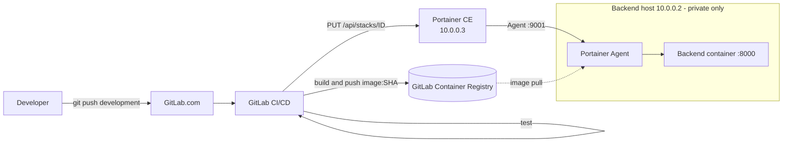

# GitLab CI → Portainer Continuous Deployment Pipeline

A GitOps-style continuous deployment pipeline that takes a containerized Python
(FastAPI) backend from a `git push` to a running container on a **private-only**
server, with no manual steps and no SSH access from CI.

> The pipeline runs on GitLab.com. This repository documents the design,
> configuration and operational details of that setup.

## Highlights

- **Fully automated**: every commit to the `development` branch is tested, built, published and deployed.
- **Immutable, traceable releases**: images are tagged with the commit SHA (never `latest`), so the running container always maps to an exact commit.
- **Split control plane / workload**: Portainer runs on one server, the backend on another, connected over a private network.
- **No public exposure**: the backend binds only to its private interface (`10.0.0.2:8000`).
- **No SSH from CI**: deployment goes through the Portainer HTTP API using a scoped access token.
- **Safe concurrency**: a GitLab `resource_group` serializes deployments to the same environment.

## Architecture



| Component | Host | Role |
|---|---|---|
| Portainer CE 2.45 LTS | `10.0.0.3` | Deployment control plane |
| Backend (FastAPI) | `10.0.0.2` | Workload, reachable on the private network only |
| GitLab.com + Container Registry | SaaS | Source, CI/CD, image storage |

Both servers are Hetzner Cloud instances attached to the same private network.

## Pipeline

| Stage | What it does |
|---|---|
| `test` | Installs dependencies and byte-compiles the application (`python -m compileall`) |
| `build` | Builds the image with Docker-in-Docker and pushes `registry/project:<commit-sha>` |
| `deploy` | Renders `deploy/stack.template.yaml` with the new image tag and updates the Portainer stack through its API with `PullImage=true` |

The deploy job builds its JSON payload with `jq` (no hand-escaped strings) and
uses `curl --fail-with-body`, so a failed API call fails the pipeline with the
server's error message visible in the job log.

## Repository layout

```
.
├── app/
│   ├── __init__.py
│   └── main.py                  # FastAPI app: / and /health
├── deploy/
│   └── stack.template.yaml      # Stack definition rendered by CI
├── docs/
│   ├── setup.md                 # Step-by-step environment setup
│   └── troubleshooting.md
├── .env.example                 # CI variables reference
├── .gitlab-ci.yml               # test -> build -> deploy
├── compose.yaml                 # Local development
├── Dockerfile
└── requirements.txt
```

## Required CI/CD variables

| Variable | Description | Settings |
|---|---|---|
| `PORTAINER_URL` | Base URL of Portainer | Visible |
| `PORTAINER_API_KEY` | Portainer access token | Masked / hidden |
| `PORTAINER_STACK_ID` | ID of the target stack | Visible |
| `PORTAINER_ENDPOINT_ID` | ID of the target environment (the backend host) | Visible |

See [docs/setup.md](docs/setup.md) for the full setup procedure.

## Run locally

```bash
docker compose up --build
curl http://localhost:8000/health   # {"status":"healthy"}
```

## Design decisions

- **Commit-SHA tags over `latest`**: deterministic deployments, trivial rollbacks (redeploy an older SHA), no stale-cache surprises.
- **API-based deployment over SSH**: no long-lived SSH keys in CI, deployments are auditable in Portainer, and access is revocable by deleting one token.
- **Private bind address**: the port mapping uses the private IP, so a misconfigured firewall cannot expose the service.
- **Non-root container and health check**: the image runs as an unprivileged user and declares a `HEALTHCHECK`.

## Possible improvements

- Pin dependency versions and add unit tests plus linting to the `test` stage.
- Add image vulnerability scanning (e.g. Trivy) before the push.
- Promote the same image to a `production` environment with a manual approval gate.
- Automated rollback on failed health check, and Prometheus metrics/alerting.

## License

MIT
